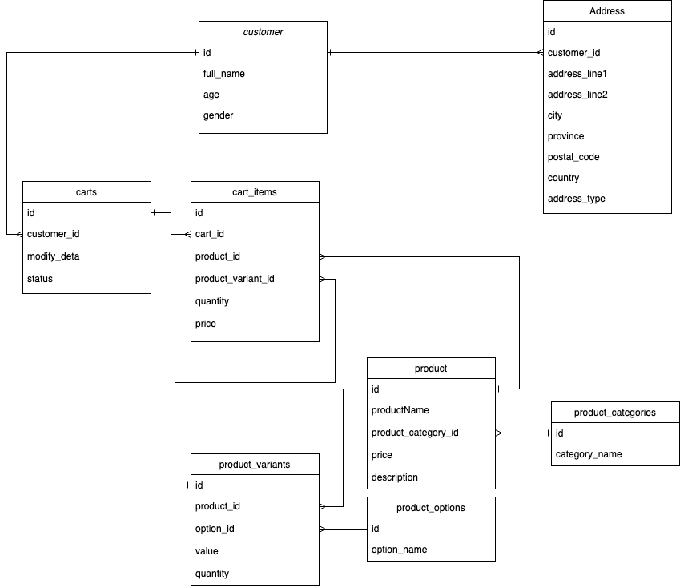

<p align="center">
  <a href="http://nestjs.com/" target="blank"></a>
</p>

[circleci-image]: https://img.shields.io/circleci/build/github/nestjs/nest/master?token=abc123def456
[circleci-url]: https://circleci.com/gh/nestjs/nest

  <p align="center">A progressive <a href="http://nodejs.org" target="_blank">Node.js</a> framework for building efficient and scalable server-side applications.</p>
    <p align="center">
<a href="https://www.npmjs.com/~nestjscore" target="_blank"></a>
<a href="https://www.npmjs.com/~nestjscore" target="_blank"></a>
<a href="https://www.npmjs.com/~nestjscore" target="_blank"></a>
<a href="https://circleci.com/gh/nestjs/nest" target="_blank"></a>
<a href="https://discord.gg/G7Qnnhy" target="_blank"></a>
<a href="https://opencollective.com/nest#backer" target="_blank"></a>
<a href="https://opencollective.com/nest#sponsor" target="_blank"></a>
  <a href="https://paypal.me/kamilmysliwiec" target="_blank"></a>
    <a href="https://opencollective.com/nest#sponsor"  target="_blank"></a>
  <a href="https://twitter.com/nestframework" target="_blank"></a>
</p>
  <!--[](https://opencollective.com/nest#backer)
  [](https://opencollective.com/nest#sponsor)-->

# Node.js Server-Side Challenge

This project is a Node.js server-side application built with NestJS. It includes user management functionalities such as creating, updating, deleting users, and changing passwords. The project also includes authentication using an interceptor.

## Installation

1. Clone the repository:

   ```bash
   git clone https://github.com/supacheep-first/opn-challenge.git
   cd opn-challenge
   ```

2. Install dependencies:
   ```bash
   pnpm install
   ```

## Running the Application

1. Start the development server:

   ```bash
   pnpm run start:dev
   ```

2. The server will be running at `http://localhost:3000`.

## Testing

1. Run the tests:
   ```bash
   pnpm run test
   ```

## API Endpoints

### Users

- **Create User**

  - `POST /users`
  - Body: `CreateUserDto`
  - Example:
    ```bash
    curl --location 'http://localhost:3000/users' \
    --header 'Content-Type: application/json' \
    --data-raw '{
      "name": "first",
      "email": "first@example.com",
      "password": "password123",
      "dateOfBirth": "1991-01-11",
      "gender": "male",
      "address": "123 Bangkok, Thailand",
      "subscription": true
    }'
    ```

- **Get All Users**

  - `GET /users`
  - Headers: `Authorization: Bearer faketoken_user1`
  - Example:
    ```bash
    curl -X GET http://localhost:3000/users \
    -H "Authorization: Bearer faketoken_user1"
    ```

- **Get User by ID**

  - `GET /users/:id`
  - Headers: `Authorization: Bearer faketoken_user1`
  - Example:
    ```bash
    curl -X GET http://localhost:3000/users/1 \
    -H "Authorization: Bearer faketoken_user1"
    ```

- **Update User**

  - `PATCH /users/:id`
  - Headers: `Authorization: Bearer faketoken_user1`
  - Body: `UpdateUserDto`
  - Example:
    ```bash
    curl --location --request PATCH 'http://localhost:3000/users/1' \
    --header 'Content-Type: application/json' \
    --data '{
      "dateOfBirth": "1992-02-22",
      "gender": "male",
      "address": "123 Bangkok, Thailand",
      "subscription": true
    }'
    ```

- **Delete User**

  - `DELETE /users/:id`
  - Headers: `Authorization: Bearer faketoken_user1`
  - Example:
    ```bash
    curl -X DELETE http://localhost:3000/users/1 \
    -H "Authorization: Bearer faketoken_user1"
    ```

- **Change Password**

  - `PATCH /users/:id/change-password`
  - Headers: `Authorization: Bearer faketoken_user1`
  - Body: `ChangePasswordDto`
  - Example:
    `bash
curl --location --request PATCH 'http://localhost:3000/users/1/change-password' \
--header 'Content-Type: application/json' \
--data '{
  "currentPassword": "newPassword123",
  "newPassword": "1234"
}'
`

## Database diagram

https://drive.google.com/file/d/12i7u5d-sGJ_Pn1k9nXvH0xg6bY02ZLQX/view


